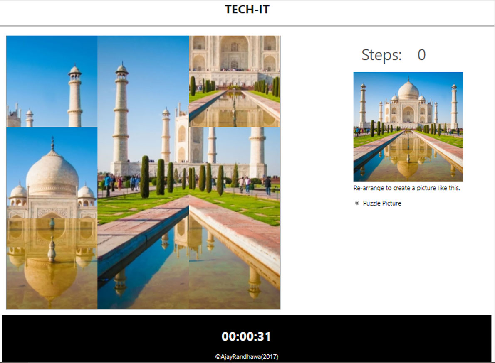

Image-Puzzle-Game
Image Puzzle is Game For I Designed College Technical Event. It Is Designed With HTML, CSS, Javascript, Jquery. Image Complete with Mouse drag Functionalities . It Has Also Step Count and Time Count Functionalities.You Can Also Switch to Difficulty Mode.


## Game View



## Increase Difficulty of Game

open "index.html" file in notepad and edit input value.

```
Change Value of Input Field "value=3" eg: "value="9" 
<input type="radio" name="level" id="hard" checked="checked" value="3" /> <label for="hard">Puzzle Picture</label>
```

## Version

2.0

## Authors

THE DRE TECH
